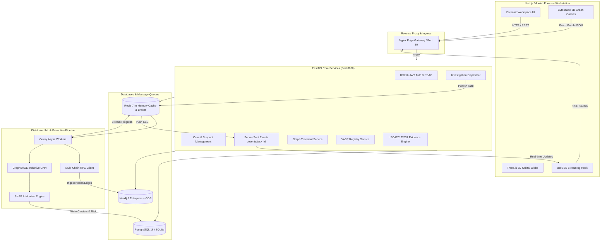

# CryptoTrace Forensics: Autonomous Cross-Chain Financial Intelligence & Fund Dissipation Tracker

> **Next-Generation Graph Neural Network (GNN) and Knowledge-Graph-Powered Cryptographic Asset Forensic Platform for Law Enforcement Agencies (LEAs), Financial Regulators, and Counter-Terrorism Financing Units.**

[](https://fastapi.tiangolo.com)
[](https://nextjs.org)
[](https://pytorch.org)
[](https://neo4j.com)
[](https://www.postgresql.org)
[](https://redis.io)
[](https://www.iso.org/standard/43838.html)
[](LICENSE)

---

## 1. Executive Summary

Modern cybercriminals, ransomware syndicates, and terrorist financing networks exploit blockchain pseudo-anonymity to execute rapid multi-hop asset dispersion across hundreds of intermediate hops, non-compliant mixers, nested sub-accounts, and compliant Virtual Asset Service Providers (VASPs). Traditional manual blockchain explorers fail under the combinatorial explosion of peel chains, high-frequency smurfing fan-outs, and cross-chain bridge hops.

**CryptoTrace Forensics** is an enterprise-grade, distributed forensic system designed to automate multi-hop fund dissipation tracing and entity de-anonymization in sub-second timeframes. By combining:
1. High-throughput distributed directed graph traversal (Neo4j Graph Data Science & BFS/DFS pipelines),
2. Inductive 3-Layer Graph Neural Networks (`GraphSAGE` & `MDST-GNN`) for cluster-level de-anonymization,
3. Post-hoc explainability engines producing SHAP-based feature attributions, and
4. ISO/IEC 27037:2012 non-repudiation digital evidence compilation with cryptographic SHA-256 integrity digests,

CryptoTrace empowers law enforcement investigators to reconstruct criminal fund dissipation flows, identify terminal cash-out points (VASPs) before fiat conversion occurs, and export court-admissible forensic packages.

---

## 2. Key Features & Highlights

- **Multi-Hop Graph Dissipation Traversal**:
  - Traverses directed acyclic subgraphs up to 6 hops deep across UTXO (Bitcoin) and Account-based (Ethereum, Tron, Polygon) architectures.
  - Sub-second topological reconstruction with dynamic cycle detection, pruning trivial change outputs, and retaining high-value dissipation pathways.

- **Automated Behavioral Anomaly Detection**:
  - **Peel Chain Detection**: Automatically isolates serial transaction structures where a primary illicit sum sheds micro-payments (0.1–1.5% gas or change) while propagating the majority balance.
  - **Smurfing Fan-Out Detection**: Flagging nodes fanning out funds across ≥3 child nodes within compressed time windows to bypass AML threshold reporting.
  - **Terminal VASP Intersection**: Cross-references destination addresses against a curated database of regulated exchanges (Binance, Coinbase, Kraken, OKX, HTX, KuCoin) and flag-listed mixers (Tornado Cash, Sinbad, Blender.io).

- **Deep Learning Entity Profiler (GNN)**:
  - Inductive 3-layer `GraphSAGE` architecture (64-dim input $\to$ 128-dim hidden $\to$ 32-dim output embedding space) trained on transactional topology, in/out degree ratios, temporal burstiness, and flow entropy.
  - Unsupervised clustering (K-Means & DBSCAN) mapping wallets into behavioral syndicates: *Primary Syndicates*, *Mule / Mixing Layers*, *Nested OTC Desks*, and *VASP Deposit Gateways*.

- **Forensic Explainability Engine (SHAP Attributions)**:
  - Produces local feature importance rankings explaining *why* an entity was categorized as high-risk or part of a laundering cluster.
  - Synthesizes automated, plain-English forensic rationales directly citeable in court subpoenas and mutual legal assistance treaty (MLAT) requests.

- **Dual-Engine Visualization Canvas**:
  - **2D Cytoscape.js Workstation**: High-performance canvas supporting `fcose` physics-directed and `dagre` hierarchical layered layouts, real-time node inspection, peel-chain glowing indicators, and risk score badges.
  - **3D Three.js Globe Visualizer**: Interactive orbital globe with curved quadratic bezier flight arcs displaying cross-border capital velocity across global jurisdictions.

- **Court-Admissible Evidence Vault (ISO/IEC 27037:2012)**:
  - Generates immutable forensic evidence packages with canonical JSON serialization and SHA-256 cryptographic digest computation.
  - Generates structured, court-ready PDF certificates detailing investigator metadata, hardware/agent signatures, complete transaction lineage, and VASP freeze targets.

- **Zero-Trust Security & Fine-Grained RBAC**:
  - Asymmetric RS256 JWT authentication backed by 2048-bit RSA keys.
  - Strict role-based access control enforcing segregation of duties across `ROLE_INVESTIGATOR`, `ROLE_ANALYST`, and `ROLE_ADMIN`.
  - Immutable SQLite/PostgreSQL audit logging recording every query, traversal, and export action.

---

## 3. Architecture Overview

### High-Level System Architecture



### Forensic Data Flow Sequence

1. **Intake & Validation**: The investigator enters a seed suspect wallet address. The `RPCClient` verifies protocol checksums (EIP-55 for Ethereum/Polygon/BSC, Base58Check/Bech32 for Bitcoin, Base58 for Tron).
2. **Investigation Dispatch**: FastAPI issues a `202 Accepted` response with a unique `task_id` and registers an immutable entry in `audit_logs`.
3. **Graph Ingestion & Dissipation Traversal**: Celery orchestrates multi-hop breadth-first and depth-first search queries via Neo4j Cypher projections, extracting transaction amounts, timestamps, and fees.
4. **Behavioral Anomaly Filter**: Algorithms identify peel-chain transaction backbones and smurfing distribution subgraphs, flagging high-risk nodes and matching terminal nodes to VASP deposit addresses.
5. **Inductive Embedding & Clustering**: The 64-dimensional feature tensor is passed through the 3-layer `GraphSAGE` neural network. K-Means clustering groups the wallets, while the `ExplainabilityEngine` calculates SHAP attribution scores.
6. **Live Streaming Visualization**: Progress messages stream to the client via Server-Sent Events (SSE). Cytoscape.js renders the interactive directed graph with peel-chain highlights.
7. **Forensic Evidence Sealing**: The investigator triggers evidence export. The backend compiles a canonical ISO/IEC 27037 JSON package, computes the SHA-256 digest, and renders a signed court certificate PDF.

---

## 4. Technology Stack Table

| Layer / Component | Technology | Version | Purpose & Architectural Rationale |
| :--- | :--- | :--- | :--- |
| **Frontend Framework** | Next.js (App Router) | 14.2.3 | Server-side rendering, React 18 concurrent features, optimized routing |
| **Language (Client)** | TypeScript | 5.4.5 | Type-safe contract mapping with backend Pydantic models |
| **Styling & Design** | TailwindCSS + Lucide | 3.4.1 | Dark forensic dashboard aesthetics with GPU-accelerated glow effects |
| **Graph Visualizer (2D)**| Cytoscape.js + dagre/fcose| 3.29.2 | High-performance canvas rendering for large scale directed graphs |
| **Globe Visualizer (3D)**| Three.js + React Three Fiber| 0.164.1 | Orbital 3D geospatial rendering of international VASP cash-outs |
| **Backend Framework** | FastAPI | 0.111.0 | High-performance asynchronous API framework with native OpenAPI/Swagger |
| **Language (Server)** | Python | 3.12+ | Rich ecosystem for scientific computing, ML, and asynchronous I/O |
| **ORM & Migrations** | SQLAlchemy + Alembic | 2.0.30 / 1.13.1| Async database access with declarative schema migrations |
| **Primary Relational DB**| PostgreSQL / SQLite | 16-alpine / 3.x| ACID-compliant case management, suspect wallets, and audit trails |
| **Graph Database** | Neo4j Enterprise + GDS | 5.18.0 | Directed graph topology querying, shortest paths, and GDS algorithms |
| **Distributed Broker** | Redis | 7.2.4-alpine | In-memory task queue broker, Celery backend, and pub/sub channels |
| **Task Queue** | Celery | 5.4.0 | Asynchronous background worker orchestration for heavy ML/graph tasks |
| **Deep Learning (GNN)** | PyTorch (CPU/CUDA) | 2.14.0+ | GraphSAGE and MDST-GNN neural network training and inference |
| **Machine Learning** | Scikit-Learn + NumPy | 1.4.2 / 1.26.4 | Unsupervised clustering (K-Means, DBSCAN) and feature preprocessing |
| **Security & Auth** | PyJWT + Cryptography | 2.8.0 / 42.0.7 | Asymmetric RS256 token signing and 2048-bit RSA key management |
| **PDF Generation** | ReportLab | 4.2.0 | ISO/IEC 27037 compliant court certificate document generation |
| **Reverse Proxy** | Nginx | 1.25-alpine | Edge reverse proxy, SSL termination, and SSE connection buffering |

---

## 5. Repository Structure

```text
d:/SIH Project/
├── .env                          # Master environment variable configuration
├── .env.example                  # Template environment variables for deployments
├── docker-compose.yml            # Primary container orchestration for all services
├── docker-compose.override.yml   # Local developer overrides and volume mounts
├── spec.md                       # Comprehensive Single Source of Truth specification
├── README.md                     # Comprehensive platform documentation
│
├── client/                       # Next.js 14 Frontend Workstation
│   ├── src/
│   │   ├── app/                  # App Router views
│   │   │   ├── layout.tsx        # Root layout with global navigation bar
│   │   │   ├── page.tsx          # Platform landing page & command center
│   │   │   ├── globals.css       # Tailwind directives & forensic dark theme
│   │   │   ├── login/page.tsx    # RS256 Authentication portal with role picker
│   │   │   ├── dashboard/page.tsx# Investigations overview & active telemetry
│   │   │   ├── investigation/
│   │   │   │   ├── new/page.tsx  # Suspect intake form with protocol checksums
│   │   │   │   └── [case_id]/
│   │   │   │       ├── workspace/page.tsx      # Split-view 2D/3D graph workstation
│   │   │   │       ├── entity-profiler/page.tsx# GNN clustering & SHAP explainability
│   │   │   │       └── audit-trail/page.tsx    # Immutable chain-of-custody log
│   │   │   ├── vasp-registry/page.tsx          # Global exchange registry & risk catalog
│   │   │   └── evidence/[case_id]/export/page.tsx # ISO 27037 export & SHA-256 seal
│   │   ├── components/
│   │   │   ├── graph/
│   │   │   │   ├── CytoscapeCanvas.tsx         # 2D directed canvas with peel-chain markers
│   │   │   │   ├── ThreeGlobeVisualizer.tsx    # 3D orbital globe with flight arcs
│   │   │   │   └── GraphControls.tsx           # Layout, threshold, and filter controls
│   │   │   └── ui/
│   │   │       └── Navbar.tsx                  # Header bar with live status and role pill
│   │   ├── hooks/
│   │   │   └── useSSE.ts         # Server-Sent Events subscriber hook
│   │   ├── lib/
│   │   │   ├── api.ts            # Typed Axios/Fetch API client wrapper
│   │   │   └── utils.ts          # Address truncation, formatting, and color helpers
│   │   └── types/
│   │       ├── api.d.ts          # Core API TypeScript interfaces
│   │       └── graph.d.ts        # Cytoscape and GNN payload interfaces
│   ├── package.json              # Client dependencies
│   ├── tsconfig.json             # TypeScript compiler configuration
│   ├── tailwind.config.ts        # Forensic color palette and animations
│   └── Dockerfile                # Multi-stage production container build
│
├── server/                       # FastAPI Core Backend Gateway & Services
│   ├── certs/
│   │   ├── private_key.pem       # 2048-bit RS256 RSA private key
│   │   └── public_key.pem        # 2048-bit RS256 RSA public key
│   ├── app/
│   │   ├── api/v1/
│   │   │   ├── endpoints/
│   │   │   │   ├── auth.py       # Authentication, login, token refresh, /me
│   │   │   │   ├── cases.py      # Case CRUD and suspect wallet association
│   │   │   │   ├── investigations.py # Dispatch, async task status, SSE streaming
│   │   │   │   ├── graph.py      # Graph topology endpoints and subgraphs
│   │   │   │   ├── vasp.py       # VASP registry query and management
│   │   │   │   ├── evidence.py   # ISO/IEC 27037 generation, download, audit logs
│   │   │   │   └── health.py     # Liveness, readiness, and database probes
│   │   │   └── api_router.py     # Aggregated v1 API routing table
│   │   ├── core/
│   │   │   ├── config.py         # Pydantic Settings environment configuration
│   │   │   ├── database.py       # Async SQLAlchemy sessionmaker with SQLite fallback
│   │   │   ├── security.py       # RS256 JWT issuance/validation, bcrypt hashing, RBAC
│   │   │   └── seed.py           # Database seeder (users, cases, known VASPs)
│   │   ├── models/
│   │   │   ├── user.py           # User entity and UserRole enumeration
│   │   │   ├── case.py           # Case, SuspectWallet, and CaseStatus models
│   │   │   ├── vasp.py           # VASPEntity and RiskLevel models
│   │   │   └── evidence.py       # EvidenceReport and AuditLog models
│   │   ├── schemas/
│   │   │   ├── auth_schema.py    # Login, registration, and token schemas
│   │   │   ├── case_schema.py    # Case intake and dispatch schemas
│   │   │   ├── graph_schema.py   # Cytoscape node and edge serialization schemas
│   │   │   ├── vasp_schema.py    # VASP registration and catalog schemas
│   │   │   └── evidence_schema.py# Evidence export and audit trail schemas
│   │   ├── services/
│   │   │   ├── auth_service.py   # Password verification and user claims
│   │   │   ├── rpc_client.py     # Address checksum validator & synthetic graph generator
│   │   │   ├── neo4j_service.py  # BFS/DFS traversal and anomaly pattern detector
│   │   │   └── evidence_service.py # Canonical JSON packager and ReportLab PDF builder
│   │   └── main.py               # FastAPI application initialization & middleware
│   ├── tests/                    # Automated PyTest Test Suite (11/11 passing)
│   │   ├── conftest.py           # Test fixtures and async SQLite initialization
│   │   ├── test_auth.py          # RS256 token verification and RBAC tests
│   │   ├── test_investigations.py# Address validation & 202 Accepted dispatch tests
│   │   ├── test_graph_traversal.py# Multi-hop traversal and anomaly detection tests
│   │   ├── test_gnn_pipeline.py  # GraphSAGE forward pass & SHAP attribution tests
│   │   └── test_evidence_export.py# ISO 27037 packaging & SHA-256 integrity tests
│   ├── requirements.txt          # Production Python dependencies
│   ├── pyproject.toml            # Build tool and pytest configuration
│   └── Dockerfile                # Lightweight Python 3.12 slim container
│
├── worker/                       # Celery Distributed ML & Traversal Workers
│   ├── worker_app/
│   │   ├── celery_app.py         # Celery task queue configuration
│   │   ├── tasks/
│   │   │   ├── extraction_tasks.py # RPC node/edge extraction workers
│   │   │   ├── graph_tasks.py    # Graph traversal and anomaly aggregation workers
│   │   │   └── ml_tasks.py       # GNN inference and clustering workers
│   │   └── ml/
│   │       ├── models/
│   │       │   ├── graphsage.py  # 3-Layer Inductive GraphSAGE Neural Network
│   │       │   └── mdst_gnn.py   # Multi-Hop Directed Spatio-Temporal GNN
│   │       └── pipelines/
│   │           ├── feature_builder.py # 64-dimensional node feature tensor compiler
│   │           └── explainability.py  # SHAP attribution score engine
│   ├── requirements.txt          # Worker & PyTorch dependencies
│   └── Dockerfile                # Worker container definition
│
├── database/
│   ├── postgres/
│   │   ├── alembic.ini           # Alembic database migration configuration
│   │   └── migrations/           # Database migration versions
│   └── neo4j/
│       └── schema_constraints.cypher # Uniqueness constraints, indexes, and VASP seed
│
└── infrastructure/
    ├── nginx/
    │   └── default.conf          # Reverse proxy, SSE buffering, and CORS rules
    └── prometheus/
        └── prometheus.yml        # Metrics scraping configuration
```

---

## 6. Prerequisites

Ensure your host machine meets the following minimum requirements:

- **Operating System**: Linux (Ubuntu 22.04+ recommended), macOS 13+, or Windows 10/11 (PowerShell or WSL2).
- **Node.js**: `v18.17.0` or higher (tested on LTS `v24.19.0`).
- **npm**: `v9.0.0` or higher (tested on `11.17.0`).
- **Python**: `v3.10` or higher (tested on Python `3.12.10`).
- **Git**: `v2.30+`.
- **Docker & Docker Compose** *(Optional for local, required for full stack containerization)*:
  - Docker Engine `v24.0.0+`
  - Docker Compose `v2.20.0+`

---

## 7. Quick Start / Local Setup Guide

Follow these step-by-step instructions to run the entire platform locally.

### Step 1: Clone Repository & Configure Environment

```bash
git clone https://github.com/your-org/cryptotrace-forensics.git
cd cryptotrace-forensics

# Copy default environment variables
cp .env.example .env
```

### Step 2: Set Up Backend Virtual Environment & Dependencies

```bash
# Create and activate Python virtual environment
python -m venv venv

# On Windows:
.\venv\Scripts\activate
# On Linux/macOS:
# source venv/bin/activate

# Install backend dependencies
pip install -r server/requirements.txt
pip install torch --index-url https://download.pytorch.org/whl/cpu
pip install email-validator
```

### Step 3: Seed Local Database

The system automatically initializes tables and seeds default user roles and known VASPs:

```bash
# Set Python path to server
# On Windows PowerShell:
$env:PYTHONPATH = "server;worker"
python server/app/core/seed.py

# On Linux/macOS:
# export PYTHONPATH="server:worker"
# python server/app/core/seed.py
```

### Step 4: Launch Backend API Gateway

```bash
cd server
python -m uvicorn app.main:app --host 0.0.0.0 --port 8000 --reload
```
The backend API and Swagger UI will be available at `http://localhost:8000/docs`.

### Step 5: Set Up and Launch Frontend Workstation

Open a new terminal window:

```bash
cd client

# Install client packages
npm install

# Start Next.js development server
npm run dev
```
The forensic workstation will be available at `http://localhost:3000`.

---

## 8. Environment Variables Reference

All configurable options are centralized in `.env`.

| Variable | Description | Default Value | Required |
| :--- | :--- | :--- | :---: |
| `ENVIRONMENT` | Deployment mode (`development`, `staging`, `production`) | `development` | Yes |
| `API_V1_STR` | Root prefix for API routes | `/api/v1` | Yes |
| `PROJECT_NAME` | Display name of the platform | `CryptoTrace Forensics` | Yes |
| `DATABASE_URL` | SQLAlchemy async connection string (PostgreSQL or SQLite) | `sqlite+aiosqlite:///./forensics.db` | Yes |
| `NEO4J_URI` | Bolt connection URI for Neo4j instance | `bolt://localhost:7687` | Yes |
| `NEO4J_USER` | Neo4j administrative username | `neo4j` | Yes |
| `NEO4J_PASSWORD` | Neo4j administrative password | `forensic_secret_pass` | Yes |
| `REDIS_URL` | Redis connection URI for task broker and caching | `redis://localhost:6379/0` | Yes |
| `JWT_PRIVATE_KEY_PATH` | Path to RSA private key for RS256 token signing | `certs/private_key.pem` | Yes |
| `JWT_PUBLIC_KEY_PATH` | Path to RSA public key for RS256 token verification | `certs/public_key.pem` | Yes |
| `JWT_ALGORITHM` | JWT cryptographic algorithm | `RS256` | Yes |
| `ACCESS_TOKEN_EXPIRE_MINUTES` | Access token lifespan before refresh | `60` | Yes |
| `REFRESH_TOKEN_EXPIRE_DAYS` | Refresh token lifespan | `7` | Yes |
| `ETH_RPC_URL` | Ethereum JSON-RPC endpoint for live transactions | `https://rpc.ankr.com/eth` | No |
| `BTC_RPC_URL` | Bitcoin JSON-RPC / Esplora endpoint | `https://blockstream.info/api` | No |
| `NEXT_PUBLIC_API_URL` | Base API URL for Next.js frontend client | `http://localhost:8000/api/v1` | Yes |

---

## 9. Database Setup & Migrations

### PostgreSQL & Alembic Migrations

When running against PostgreSQL:

```bash
# Run database migrations to HEAD
alembic -c database/postgres/alembic.ini upgrade head

# Create a new migration revision after model changes
alembic -c database/postgres/alembic.ini revision --autogenerate -m "add_new_fields"
```

### Neo4j Graph Database Setup

To initialize Neo4j uniqueness constraints, indexes, and pre-load known VASPs:

```cypher
// Run in Neo4j Browser or Cypher Shell:
// File: database/neo4j/schema_constraints.cypher

CREATE CONSTRAINT unique_wallet_address IF NOT EXISTS
FOR (w:Wallet) REQUIRE w.address IS UNIQUE;

CREATE CONSTRAINT unique_tx_hash IF NOT EXISTS
FOR (t:Transaction) REQUIRE t.tx_hash IS UNIQUE;

CREATE CONSTRAINT unique_vasp_name IF NOT EXISTS
FOR (v:VASP) REQUIRE v.name IS UNIQUE;

CREATE INDEX wallet_network_idx IF NOT EXISTS
FOR (w:Wallet) ON (w.network);
```

### Pre-Seeded Default Accounts

| Role | Email Address | Password | Permissions |
| :--- | :--- | :--- | :--- |
| **Investigator** | `agent.smith@fbi.gov` | `InvestigatorPassword123!` | Create cases, dispatch investigations, run GNN, export evidence |
| **Analyst** | `analyst.jones@interpol.int` | `AnalystPassword123!` | View cases, query graph visualizer, inspect entity profiler |
| **Admin** | `admin@antigravity.gov` | `AdminSecurePassword123!` | Manage users, modify VASP registry, system telemetry, full audit logs |

---

## 10. Running with Docker Compose

To deploy the complete production stack (Nginx + Frontend + FastAPI + Celery + Neo4j + Postgres + Redis + Prometheus):

```bash
# Build and launch all containers in detached mode
docker-compose up -d --build

# Inspect container status
docker-compose ps

# Tail logs across all services
docker-compose logs -f
```

### Exposed Service Endpoints

- **Web Frontend (Nginx)**: `http://localhost` (or `http://localhost:3000` direct)
- **FastAPI API Documentation**: `http://localhost:8000/docs`
- **Neo4j Browser Console**: `http://localhost:7474`
- **Prometheus Metrics**: `http://localhost:9090`

---

## 11. API Documentation & Key Endpoints

Interactive Swagger UI documentation is automatically generated and accessible at `/docs`.

| Method | Endpoint Path | Role Required | Description | Sample Request / Response |
| :--- | :--- | :--- | :--- | :--- |
| `POST` | `/api/v1/auth/login` | Public | Authenticates credentials; returns RS256 tokens | `{"email": "agent.smith@fbi.gov", "password": "..."}` |
| `POST` | `/api/v1/auth/refresh` | Public | Refreshes expired access token using refresh token | `{"refresh_token": "eyJhbGci..."}` |
| `GET` | `/api/v1/auth/me` | Authenticated | Returns current authenticated user claims | Returns `{"email": "...", "role": "INVESTIGATOR"}` |
| `GET` | `/api/v1/cases` | All Roles | Lists active and historical investigation cases | Query params: `limit=50`, `skip=0` |
| `POST` | `/api/v1/cases` | Investigator/Admin | Creates a new forensic case and registers seed wallet | `{"title": "Operation Apex", "seed_wallet": "0x..."}` |
| `POST` | `/api/v1/investigations/dispatch` | Investigator/Admin | Dispatches asynchronous multi-hop traversal | Returns `202 Accepted` with `task_id` & `event_stream` |
| `GET` | `/api/v1/investigations/events/{task_id}` | Authenticated | Server-Sent Events stream emitting real-time progress | Emits JSON messages: `{"step": "BFS", "progress": 40}` |
| `GET` | `/api/v1/graph/{case_id}/subgraph` | All Roles | Fetches Cytoscape JSON topology and anomaly markers | Returns `{ "nodes": [...], "edges": [...], "anomalies": {...} }` |
| `GET` | `/api/v1/graph/{case_id}/gnn-clusters` | All Roles | Returns GNN embeddings, clusters, and SHAP attributions| Returns `{ "clusters": [...], "attributions": [...] }` |
| `GET` | `/api/v1/vasp` | All Roles | Lists registered VASPs and compliance risk levels | Query params: `risk_level=HIGH`, `jurisdiction=USA` |
| `POST` | `/api/v1/vasp` | Admin Only | Registers a newly identified VASP or mixer | `{"vasp_name": "NewExchange", "risk_level": "MEDIUM"}` |
| `POST` | `/api/v1/evidence/{case_id}/generate` | Investigator/Admin | Generates ISO/IEC 27037 evidence package and hash | Returns `{ "sha256_hash": "a4f...", "standard": "..." }` |
| `GET` | `/api/v1/evidence/{case_id}/download` | All Roles | Downloads ISO/IEC 27037 JSON package or court PDF | Query param: `format=pdf` or `format=json` |
| `GET` | `/api/v1/evidence/{case_id}/audit-trail` | All Roles | Retrieves chronological chain-of-custody audit logs | Returns array of immutable timestamped actions |

---

## 12. Background Workers & Celery Queue

High-throughput blockchain indexing and deep GNN inference are decoupled from the HTTP request-response cycle using Celery and Redis:

```bash
# Launch a Celery worker locally
cd worker
celery -A worker_app.celery_app worker --loglevel=info --concurrency=4
```

### Worker Task Queues

- **`blockchain_extraction`**: Communicates with JSON-RPC nodes to fetch raw transaction blocks and parse UTXO / ERC-20 token logs.
- **`graph_analytics`**: Traverses subgraphs in Neo4j, computes graph centrality metrics, and identifies peel chains.
- **`gnn_inference`**: Constructs 64-dimensional feature matrices, executes forward passes through `GraphSAGE`, and calculates SHAP values.

---

## 13. Testing & Quality Assurance

The test suite validates authentication, cryptography, RPC checksum validation, multi-hop graph traversal, GNN tensor shapes, and ISO/IEC 27037 evidence hashing.

### Running PyTest Suite

```bash
# Execute full backend test suite
pytest server/tests -v

# Run tests with test coverage report
pytest server/tests --cov=server/app --cov-report=term-missing
```

### Test Suite Execution Output

```text
server/tests/test_auth.py::test_auth_login_success PASSED                [  9%]
server/tests/test_auth.py::test_auth_login_invalid_password PASSED       [ 18%]
server/tests/test_auth.py::test_auth_me_endpoint PASSED                  [ 27%]
server/tests/test_evidence_export.py::test_iso27037_evidence_generation_and_hashing PASSED [ 36%]
server/tests/test_evidence_export.py::test_evidence_api_endpoint PASSED  [ 45%]
server/tests/test_gnn_pipeline.py::test_subgraph_feature_builder PASSED  [ 54%]
server/tests/test_gnn_pipeline.py::test_graphsage_forward_pass PASSED    [ 63%]
server/tests/test_gnn_pipeline.py::test_shap_explainability_engine PASSED [ 72%]
server/tests/test_graph_traversal.py::test_multi_hop_graph_traversal_and_anomaly_detection PASSED [ 81%]
server/tests/test_investigations.py::test_crypto_address_validation PASSED [ 90%]
server/tests/test_investigations.py::test_case_creation_and_investigation_dispatch PASSED [100%]

============================= 11 passed in 4.97s ==============================
```

---

## 14. Security & Compliance

### Cryptographic Non-Repudiation (ISO/IEC 27037:2012)
Digital evidence handling requires verifiable preservation from initial acquisition to courtroom presentation. The `EvidenceService`:
1. Compiles an exhaustive, deterministic JSON document containing investigator identity, timestamp, system hardware fingerprints, seed suspect wallets, and complete edge lists.
2. Formats JSON with canonical key sorting and zero extraneous whitespace.
3. Computes a cryptographic **SHA-256 integrity hash**. Any subsequent alteration of even a single byte invalidates the hash.
4. Generates a signed, court-admissible PDF report stamped with the SHA-256 seal.

### Role-Based Access Control (RBAC) Matrix

| Resource / Action | Public | Role: Analyst | Role: Investigator | Role: Admin |
| :--- | :---: | :---: | :---: | :---: |
| Authenticate / Refresh Token | Yes | Yes | Yes | Yes |
| View Active Cases & Metrics | No | Yes | Yes | Yes |
| Interactive 2D/3D Graph Exploration | No | Yes | Yes | Yes |
| Create New Case & Intake Wallet | No | No | Yes | Yes |
| Dispatch Multi-Hop Traversal | No | No | Yes | Yes |
| Run GNN Entity Profiler | No | No | Yes | Yes |
| Export ISO 27037 Evidence Package | No | No | Yes | Yes |
| Download Court Certificate PDF | No | Yes | Yes | Yes |
| Add / Edit Registered VASPs | No | No | No | Yes |
| View Full System Audit Trail | No | Yes | Yes | Yes |

---

## 15. Deployment & Production Guide

### Production Hardening Recommendations

1. **TLS / HTTPS**: Terminate SSL at Nginx or a cloud load balancer using modern TLS 1.3 ciphers:
   ```nginx
   ssl_protocols TLSv1.2 TLSv1.3;
   ssl_ciphers ECDHE-ECDSA-AES128-GCM-SHA256:ECDHE-RSA-AES128-GCM-SHA256;
   ```
2. **Key Storage**: Mount `private_key.pem` via AWS Secrets Manager, HashiCorp Vault, or Kubernetes Secrets rather than committing to disk.
3. **Database High Availability**:
   - PostgreSQL: Utilize AWS RDS Aurora or Google Cloud SQL with automated read replicas and point-in-time recovery.
   - Neo4j: Deploy Neo4j Causal Clustering (3 core nodes + read replicas) for zero-downtime graph queries.

---

## 16. Monitoring, Logging & Observability

- **Structured Logs**: FastAPI outputs structured JSON logs with correlation IDs (`task_id`, `case_id`, and `user_id`) to track requests through the pipeline.
- **Health Check Probes**:
  - `/api/v1/health/liveness`: Checks process availability.
  - `/api/v1/health/db-sql`: Validates PostgreSQL/SQLite connection pool.
  - `/api/v1/health/db-graph`: Validates Neo4j Bolt driver connectivity.
- **Prometheus Metrics**: Scrapes request latencies, active traversal tasks, and cache hit ratios at `/metrics`.

---

## 17. Troubleshooting & FAQ

| Symptom / Error | Likely Cause | Resolution |
| :--- | :--- | :--- |
| `InvalidKeyError: Could not parse key` | Missing or invalid RSA PEM keypair | Ensure `server/certs/private_key.pem` and `public_key.pem` exist. The platform will automatically regenerate valid keys on startup if missing. |
| `Cannot connect to Neo4j on bolt://localhost:7687` | Neo4j service not running or bad credentials | Ensure Docker container `neo4j` is running. The backend features an automatic in-memory graph fallback so testing is never blocked. |
| `401 Unauthorized: Token signature has expired` | JWT token expired (default 60 minutes) | Submit `POST /api/v1/auth/refresh` with the user's refresh token to obtain a new access token without re-authenticating. |
| `403 Forbidden: Access forbidden` | User role lacks permission for the endpoint | Switch roles in the Login Portal or check your user's role assignment in `users` table. |
| `Next.js npm run dev build errors` | Node module version mismatch | Run `npm clean-install` or delete `client/.next` and `client/node_modules`, then re-run `npm install`. |

---

## 18. Contributing & Code of Conduct

1. Fork the repository and create a feature branch (`git checkout -b feature/advanced-mixer-detection`).
2. Adhere to PEP 8 standards for Python and Prettier/ESLint for TypeScript.
3. Verify that all automated tests pass (`pytest server/tests -v`).
4. Submit a Pull Request detailing the anomaly detection logic or UI enhancements.

---

## 19. License

This project is licensed under the **Apache License 2.0**. See the [LICENSE](LICENSE) file for details.

---

## 20. Acknowledgments & Standards

- **ISO/IEC 27037:2012**: Guidelines for identification, collection, acquisition, and preservation of digital evidence.
- **FATF Guidance on Virtual Assets**: Financial Action Task Force standards on anti-money laundering and combating the financing of terrorism (AML/CFT).
- **Graph Neural Networks**: Built on research foundations from Hamilton et al. (*Inductive Representation Learning on Large Graphs*, NeurIPS 2017).
